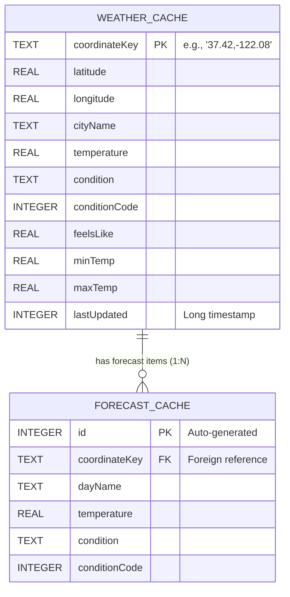

# Database Schema Documentation

The SkyCast application implements an **offline-first local cache** using **Room Database** (SQLite abstraction).

---

## 1. Database Configuration
*   **Database Class**: `com.medioka.skycast.data.local.AppDatabase`
*   **Version**: `1`
*   **Export Schema**: Disabled (`exportSchema = false`)
*   **Tables**: `weather_cache`, `forecast_cache`

---

## 2. Entity Mappings



### A. Table: `weather_cache`
Stores the current weather metrics for queried locations.

| Field Name | Type (Kotlin / Room) | Primary Key | Description |
| :--- | :---: | :---: | :--- |
| `coordinateKey` | `String` / `TEXT` | **Yes** | Formatted unique key combining `"latitude,longitude"` (e.g. `37.42,-122.08`). |
| `latitude` | `Double` / `REAL` | No | Latitude coordinate of the query. |
| `longitude` | `Double` / `REAL` | No | Longitude coordinate of the query. |
| `cityName` | `String` / `TEXT` | No | Resolved city name (via Geocoder or fallback label). |
| `temperature` | `Double` / `REAL` | No | Current temperature in Celsius. |
| `condition` | `String` / `TEXT` | No | Description of the weather condition (e.g., "Partly Cloudy"). |
| `conditionCode` | `Int` / `INTEGER` | No | Numerical weather icon/state condition code. |
| `feelsLike` | `Double` / `REAL` | No | Apparent felt temperature. |
| `minTemp` | `Double` / `REAL` | No | Minimum temperature of the day. |
| `maxTemp` | `Double` / `REAL` | No | Maximum temperature of the day. |
| `lastUpdated` | `Long` / `INTEGER` | No | Timestamp of the last successful fetch. |

### B. Table: `forecast_cache`
Stores daily weather predictions linked to parent location coordinates.

| Field Name | Type (Kotlin / Room) | Primary Key | Description |
| :--- | :---: | :---: | :--- |
| `id` | `Int` / `INTEGER` | **Yes** | Auto-incrementing identifier (`autoGenerate = true`). |
| `coordinateKey` | `String` / `TEXT` | No | Conceptual foreign key pointing to `weather_cache.coordinateKey`. |
| `dayName` | `String` / `TEXT` | No | Day of the week (e.g. `"WED"`, `"THU"`). |
| `temperature` | `Double` / `REAL` | No | Forecasted temperature of that day. |
| `condition` | `String` / `TEXT` | No | Forecasted condition text. |
| `conditionCode` | `Int` / `INTEGER` | No | Forecasted weather icon/state code. |

---

## 3. Relationships & Joins

*   **One-to-Many (1:N)**: Each `weather_cache` record can have multiple corresponding `forecast_cache` entries.
*   **Query-based Mapping**: Relationships are resolved by combining flows from both tables inside the repository:
    ```kotlin
    weatherDao.getWeatherCache(coordinateKey).combine(
        weatherDao.getForecastCache(coordinateKey)
    ) { weather, forecast ->
        weather?.toDomain(forecast)
    }
    ```

---

## 4. Data Access Object (`WeatherDao`)

*   **Insert/Update Cache**: Executed as a safe transaction to avoid orphaned forecast data.
    ```kotlin
    @Transaction
    suspend fun insertWeatherWithForecast(
        weather: WeatherCacheEntity,
        forecasts: List<ForecastCacheEntity>
    ) {
        insertWeatherCache(weather)
        deleteForecastCache(weather.coordinateKey)
        insertForecastCache(forecasts)
    }
    ```
*   **Select Current Weather**: Finds the exact record from the primary key string.
    `SELECT * FROM weather_cache WHERE coordinateKey = :coordinateKey LIMIT 1`
*   **Select Forecast List**: Finds all forecasts matching the coordinate string.
    `SELECT * FROM forecast_cache WHERE coordinateKey = :coordinateKey`
*   **Select All Saved Weather**: Fetches all locations saved in the local database.
    `SELECT * FROM weather_cache`
