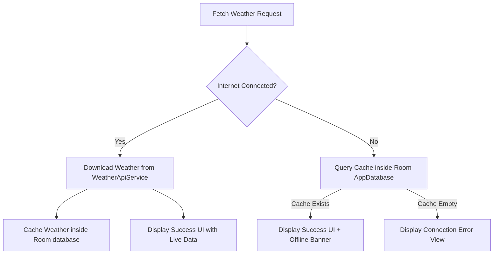

# Network Connectivity, Caching & Diagnostics Documentation

This document explains the permissions, inner workings, caching layer, and diagnostic UI components of the network infrastructure in **SkyCast**.

---

## 1. Permissions
To support network querying and dynamic network state monitoring, the application declares the following permissions in [AndroidManifest.xml](file:///Users/medioka/Programming/Android/Codelab/WeatherApp/app/src/main/AndroidManifest.xml):
- `android.permission.INTERNET`: Permits the app to create network sockets and fetch weather forecasts from remote REST APIs.
- `android.permission.ACCESS_NETWORK_STATE`: Permits the application to monitor connection changes, check active network transports, and retrieve connection details (e.g. meteredness, speed capability).

---

## 2. Dynamic Network Monitoring (`NetworkMonitor`)
The app uses a dedicated monitor class, [NetworkMonitor.kt](file:///Users/medioka/Programming/Android/Codelab/WeatherApp/app/src/main/java/com/medioka/skycast/ui/network/NetworkMonitor.kt), to observe connectivity changes reactively.

### Measured Diagnostics & API Metrics:
- **Connectivity Status**: Uses `ConnectivityManager.NetworkCallback` to detect connection loss or regain instantly.
- **Connection Type**: Identifies transport types using `NetworkCapabilities`:
  - `NetworkCapabilities.TRANSPORT_WIFI` -> **Wi-Fi**
  - `NetworkCapabilities.TRANSPORT_CELLULAR` -> **Cellular Data**
  - `NetworkCapabilities.TRANSPORT_ETHERNET` -> **Ethernet**
- **Cellular Operator Metadata**: When a cellular connection is detected, the app calls `TelephonyManager.getNetworkOperatorName()` to extract the current registered cellular provider (e.g., T-Mobile, AT&T, Vodafone).
- **Estimated downstream bandwidth**: Reads `NetworkCapabilities.linkDownstreamBandwidthKbps` to gauge network speed dynamically.
- **Billing Meteredness**: Inspects `NetworkCapabilities.NET_CAPABILITY_NOT_METERED` to determine if the user is on a capped/metered cellular plan or an unlimited plan.

---

## 3. UI Diagnostics Widget
These network parameters are piped to the [HomeScreen.kt](file:///Users/medioka/Programming/Android/Codelab/WeatherApp/app/src/main/java/com/medioka/skycast/ui/home/HomeScreen.kt) and displayed in a glassmorphic **Network Status Card**:

- **Real-Time Updates**: Utilizes a Kotlin `callbackFlow` in `NetworkMonitor` to listen to system events, wrapped into a Compose `StateFlow` in [HomeViewModel.kt](file:///Users/medioka/Programming/Android/Codelab/WeatherApp/app/src/main/java/com/medioka/skycast/ui/home/HomeViewModel.kt).
- **Visual Feedback**:
  - Displays appropriate icons: `Icons.Default.Wifi` (Wi-Fi), `Icons.Default.SignalCellularAlt` (Cellular), or `Icons.Default.CloudOff` (Offline).
  - Toggles the active status indicator dynamically between `Primary` (connected) and `Color(0xFFFFB4AB)` (disconnected).
  - Displays speed estimation: formatted dynamically into Mbps or Kbps.
  - Highlights whether data usage is metered or unlimited.

---

## 4. Offline Fallback & Room Caching Flow
To survive network disconnects (which is common in remote or bad signal areas), SkyCast implements an offline-first cache architecture:

### Underlying Cache Infrastructure:
- **Local SQLite Database**: Structured via [AppDatabase.kt](file:///Users/medioka/Programming/Android/Codelab/WeatherApp/app/src/main/java/com/medioka/skycast/data/local/AppDatabase.kt) and [WeatherDao.kt](file:///Users/medioka/Programming/Android/Codelab/WeatherApp/app/src/main/java/com/medioka/skycast/data/local/dao/WeatherDao.kt).
- **Tables**:
  - `weather_cache`: Stores the primary conditions and metrics mapped to [WeatherCacheEntity](file:///Users/medioka/Programming/Android/Codelab/WeatherApp/app/src/main/java/com/medioka/skycast/data/local/entity/WeatherCacheEntity.kt).
  - `forecast_cache`: Cache structures mapping the 5-day forecast to [ForecastCacheEntity](file:///Users/medioka/Programming/Android/Codelab/WeatherApp/app/src/main/java/com/medioka/skycast/data/local/entity/ForecastCacheEntity.kt).
- **Integration**: The [WeatherRepositoryImpl](file:///Users/medioka/Programming/Android/Codelab/WeatherApp/app/src/main/java/com/medioka/skycast/data/repository/WeatherRepositoryImpl.kt) orchestrates the fallback flow, returning cached models seamlessly whenever remote HTTP fetches fail.
