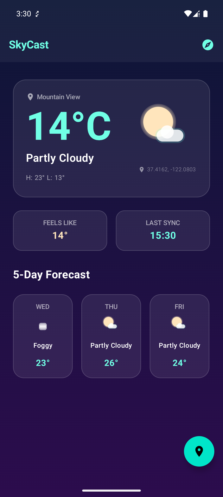
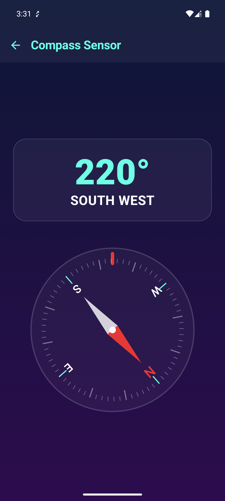
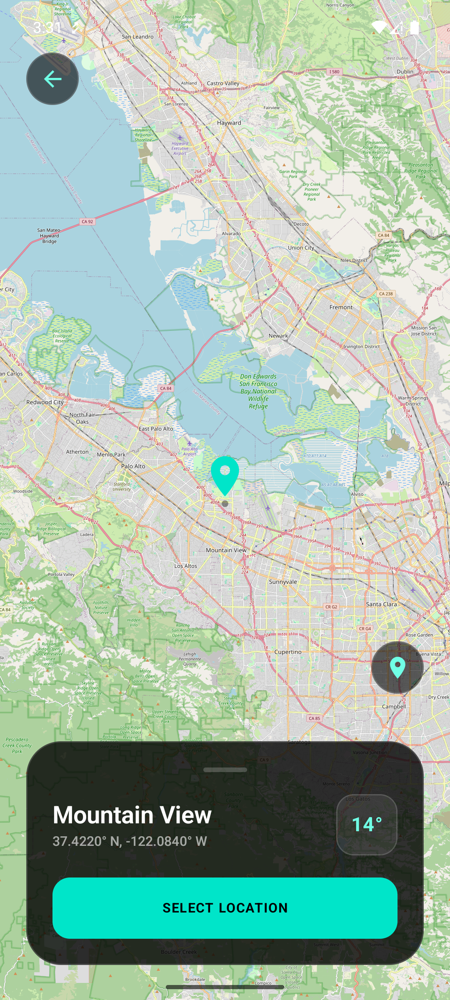
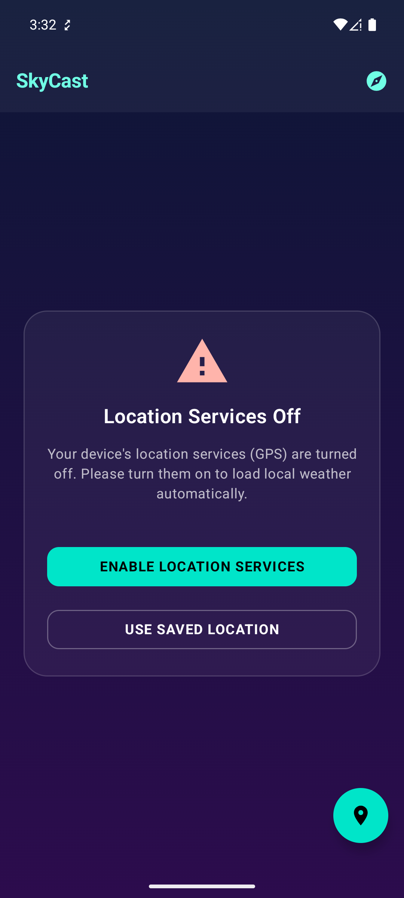

# SkyCast

A modern, offline-first Android Weather Application built with **Jetpack Compose** and structured under **Clean Architecture** principles.

---

## 1. App Showcase & Features

The application showcases integration of core Android APIs and architecture patterns through its main usage components:

1. **GPS & OpenStreetMap**:
   - Detects live user coordinates reactively on startup using the device's GPS provider via `LocationManager`.
   - Embeds an interactive offline-compatible OpenStreetMap view (`OSMDroid`) to let users pin custom coordinate locations.
   - Leverages Android `Geocoder` for background reverse-geocoding of city/location names.
2. **Room Database (Offline-First Cache)**:
   - Integrates a local SQLite cache built on Room database.
   - Caches coordinate-keyed weather data and 7-day forecasts.
   - Automatically fallbacks to offline mode and loads the latest cached weather on next boot or network dropouts.
3. **Retrofit REST API Client**:
   - Executes standard REST weather and forecast endpoints.
   - Parses network responses asynchronously using Kotlinx Serialization.
4. **Compass Hardware Sensor Integration**:
   - Accesses hardware sensors using the Android `SensorManager` API with `Sensor.TYPE_ROTATION_VECTOR`.
   - Smoothly processes telemetry azimuth angles to render a fully animated custom Canvas 3D compass rose.

### Visual Showcases

| Home Screen | Compass Sensor Screen | Map Screen |
| :---: | :---: | :---: |
|  |  |  |

| Location Disabled (Home) | Location Disabled (Map) |
| :---: | :---: |
|  |  |

---

## 2. Technical Stack
- **UI Framework**: Jetpack Compose (Material Design 3)
- **Asynchronous Flow**: Kotlin Coroutines & Flow
- **Local Cache**: Room Database (SQLite) (see [Database Schema](DATABASE.md))
- **Networking**: Retrofit & OkHttp with Kotlinx Serialization
- **Map Library**: OSMDroid wrapped in AndroidView Compose
- **Dependency Injection**: Koin
- **Hardware Integration**: Android SensorManager API (Rotation Vector Sensor) (see [Sensor Documentation](SENSORS.md))

---

## 3. Architecture Layout (Clean Architecture)

The codebase uses a clean architecture layered layout inside the `:app` module:

```
com.medioka.skycast/
├── data/
│   ├── local/             # Room Entities, DAOs, and Database setup
│   ├── remote/            # Retrofit Services, DTO models
│   └── repository/        # Repository implementation handling cache & remote bounds
├── domain/
│   ├── model/             # Plain Kotlin business models (WeatherInfo, Forecast, Coordinate)
│   ├── repository/        # Repository interfaces
│   └── usecase/           # Domain business rules (GetWeatherUseCase, SaveWeatherUseCase)
└── ui/
    ├── home/              # HomeScreen composables, HomeViewModel, HomeUiState
    ├── map/               # MapScreen composables, MapViewModel, MapUiState
    ├── compass/           # CompassScreen, CompassViewModel, CompassSensorManager
    ├── theme/             # Premium Glassmorphic colors, styles, typography definitions
    └── common/            # Custom reusable views (Skeletons, error dialogs)
```

### Clean Architecture Dependency Direction
- **UI Layer** depends on the **Domain Layer** (ViewModels consume Use Cases).
- **Data Layer** depends on the **Domain Layer** (Repositories implement Domain Interfaces).
- **Domain Layer** is completely independent of implementation details (Android framework, DB, or Network libraries).

---

## 4. Compass Sensor Implementation Details

### A. Compass Sensor Manager (`CompassSensorManager.kt`)
A helper class that encapsulates sensor event listening, transforming rotation vector values into azimuth degrees:
- Listens to `Sensor.TYPE_ROTATION_VECTOR` using coroutine `callbackFlow`.
- Translates rotation matrices using `SensorManager.getRotationMatrixFromVector()`.
- Calculates azimuth in degrees relative to magnetic North.

### B. Compass View Model (`CompassViewModel.kt`)
Exposes azimuth readings to the UI via a stateflow:
- Exposes `azimuth: StateFlow<Float>`.
- Employs lifecycle-aware coroutines to pause sensor polling when the compass screen is in the background, conserving battery.

### C. Compass Screen UI (`CompassScreen.kt`)
A Compose view matching the dark theme of the app:
- Displays numerical degrees and cardinal labels (e.g., `45° NE`).
- Custom Canvas-rendered compass rose with high-accuracy divisions and a two-tone 3D arrow pointer.
- Rotates the dial smoothly using `Modifier.graphicsLayer { rotationZ = -azimuth }`.
